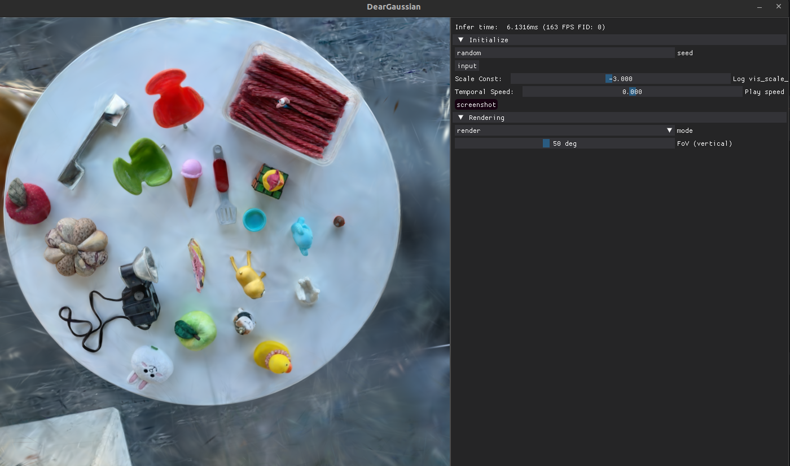

# DearGaussianGUI
A minimal GUI for 3DGS using DearPyGUI framework

```
git clone https://github.com/leviome/DearGaussianGUI --recursive
cd DearGaussianGUI
ln -s gaussian-splatting gs
CUDA_VISBILE_DEVICES=0 python main.py --model_path /path/to/scene/
```
